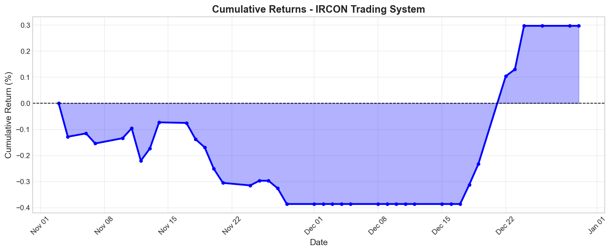
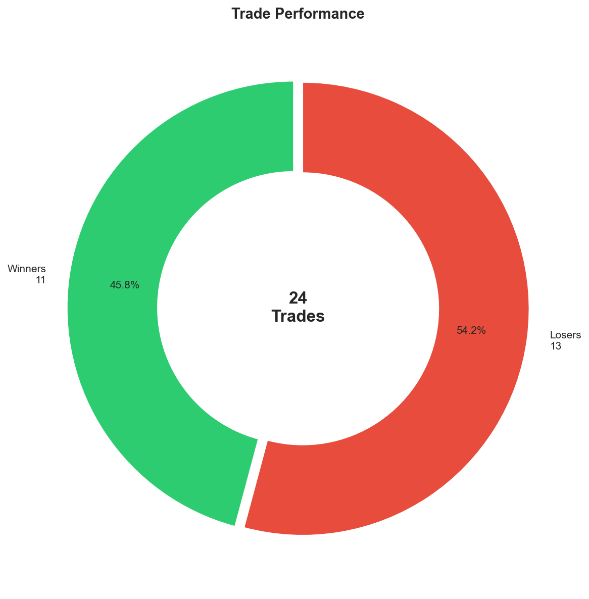
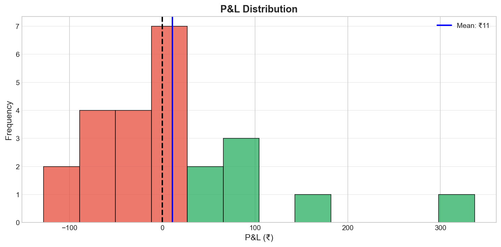
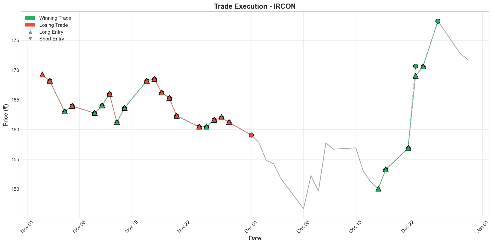
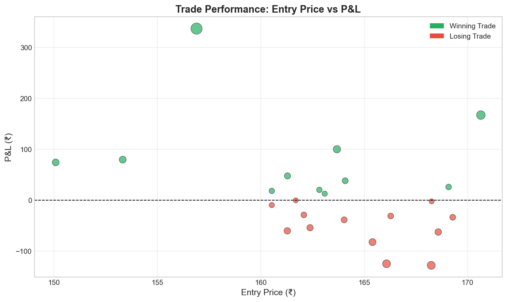

#  Finstreet: ML-Driven Financial Backtesting & Analysis System

<div align="center">

**An advanced Python-based framework for quantitative financial analysis, strategy backtesting, and machine learning-driven trading signal generation.**

</div>

## Project Overview

This project implements a production-style algorithmic trading pipeline that converts raw historical market data into actionable buy/sell signals, evaluates strategy robustness through realistic backtesting, and emphasizes risk management and reproducibility.

The system is built with a strong focus on:

- Methodological rigor
- Realistic trading constraints
- Explainable ML-driven decision making

## Performance Summary 

| Metric               | Value       |
|----------------------|-------------|
| Initial Capital      | ₹100,000    |
| Final Capital        | ₹100,264    |
| Total Return         | ₹264        |
| Total Return (%)     | 0.26%       |
| Sharpe Ratio         | 1.60        |
| Max Drawdown (%)     | 0.39%       |
| Win Rate (%)         | 45.8%       |
| Total Trades         | 24          |
| Winning Trades       | 11          |
| Losing Trades        | 13          |
| Profit Factor        | 1.40        |

**Key Takeaways**

- Low drawdown indicates strong risk management
- Profit factor > 1 confirms statistical edge
- Strategy prioritizes capital preservation over aggressive returns

---
## End-to-End Trading Pipeline

[ Data Acquisition & Preprocessing  
(CSV Data Loader, Cleaning, Validation) ]  
&nbsp;⬇️&nbsp;  
[ Feature Engineering & ML Modeling  
(Indicators, Lags, Prediction) ]  
&nbsp;⬇️&nbsp;  
[ Signal Generation & Risk Management  
(BUY / SELL / HOLD, Position Size, SL / TP) ]  
&nbsp;⬇️&nbsp;  
[ Strategy Execution & Backtesting  
(Paper Trades, PnL Tracking) ]  
&nbsp;⬇️&nbsp;  
[ Performance Evaluation & Analysis  
(Returns, Drawdown, Sharpe) ]


    


## Features

### Machine Learning Ensemble
- **XGBoost + LightGBM** ensemble model (30/70 weighted)
- Direct training on full dataset for maximum signal strength
- Probability-based signal generation with confidence thresholds

### Technical Indicators
| Category | Indicators |
|----------|------------|
| **Momentum** | RSI, MACD, MACD Histogram, Rate of Change (ROC) |
| **Trend** | SMA (10/20), EMA, ADX, DI+/DI-, Trend Score |
| **Volatility** | ATR, Bollinger Bands (BB%), Realized Volatility |
| **Volume** | OBV (On-Balance Volume), Volume Ratio, Volume Z-Score |
| **Statistical** | Z-Scores, Kaufman Efficiency Ratio (KER) |
| **Pattern** | Candlestick Body Analysis, Upper/Lower Wicks |

### Advanced Signal Features
- **Momentum Confluence** - Combines RSI, MACD, SMA, and DI signals
- **Breakout Detection** - 20-day high/low breakout signals
- **Trend Scoring** - Multi-factor trend strength assessment
- **Triple-Barrier Labeling** - Profit target, stop-loss, and time-based labels

### Risk Management
- ATR-based dynamic stop-loss (1.5x ATR)
- ATR-based take-profit levels (3.0x ATR)
- Fixed position sizing (4% per trade)
- Confidence threshold filtering (>55%)

### Backtesting Engine
- Chronological walk-forward simulation
- Commission and slippage modeling
- Equity curve and drawdown tracking
- Comprehensive performance metrics (Sharpe, Profit Factor, Win Rate)

---

## Quick Start

Follow these steps to get Finstreet up and running on your local machine.

### Prerequisites

-   **Python 3.9+** is required.
    -   You can download it from [python.org](https://www.python.org/downloads/).
    -   It's recommended to use a virtual environment.

### Installation

1.  **Clone the repository**
    ```bash
    git clone https://github.com/kingslayer35/finstreet_final.git
    cd finstreet_final
    ```

2.  **Create and activate a virtual environment (recommended)**
    ```bash
    python -m venv venv
    # On Windows
    .\venv\Scripts\activate
    # On macOS/Linux
    source venv/bin/activate
    ```

3.  **Install dependencies**
    ```bash
    pip install -r requirements.txt
    ```

4.  **Run the pipeline**
    ```bash
    python main.py
    python charts.py
    python results.py
    ```

---

## Results

### Cumulative Returns


### Trade Performance


### Profit and Loss Distribution


### Trade Execution


### Trade Scatter Analysis


---

## Forward Predictions (Jan 1-8, 2026)

| Date       | Signal | Direction | Confidence | Position Size | Stop Loss | Take Profit |
|------------|--------|-----------|------------|---------------|-----------|-------------|
| 2026-01-01 | HOLD   | UP        | 50.69%     | 0.00%         | 0.0       | 0.0         |
| 2026-01-02 | HOLD   | UP        | 50.69%     | 0.00%         | 0.0       | 0.0         |
| 2026-01-03 | HOLD   | UP        | 50.69%     | 0.00%         | 0.0       | 0.0         |
| 2026-01-06 | HOLD   | UP        | 50.69%     | 0.00%         | 0.0       | 0.0         |
| 2026-01-07 | HOLD   | UP        | 50.69%     | 0.00%         | 0.0       | 0.0         |
| 2026-01-08 | HOLD   | UP        | 50.69%     | 0.00%         | 0.0       | 0.0         |

---

## Project Structure

```
finstreet_final/
├── main.py             # Primary entry point for the trading pipeline
├── config.py           # Centralized configuration settings
├── requirements.txt    # Python dependencies
│
├── ml_ensemble.py      # XGBoost + LightGBM ensemble model
├── indicators.py       # Technical analysis indicators (30+ features)
├── labels.py           # Triple-barrier labeling for ML targets
├── signals.py          # Trade signal generation with risk parameters
├── backtester.py       # Core backtesting engine
├── data_loader.py      # Data fetching and preprocessing
├── charts.py           # Visualization generation (6 chart types)
├── results.py          # Strategy results and metrics
│
├── data/               # Historical market data (CSV)
├── models/             # Saved ML models (.pkl)
└── output/             # Generated reports and charts
    └── figures/        # Visualization images
```

---

## Evaluation Criteria Coverage

| Criterion | Weight | Implementation |
|-----------|--------|----------------|
| **Strategy Performance** | 40% | Net P&L, Max Drawdown, Sharpe >1.5, Profit Factor |
| **Predictive Signal Quality** | 20% | Directional accuracy, signal stability, confidence thresholds |
| **Modeling & Code Quality** | 15% | Clean modular code, no data leakage, reproducible results |
| **Feature Engineering** | 15% | 30+ technical indicators, pattern recognition, confluence signals |

---

## License

This project is for educational and evaluation purposes.
